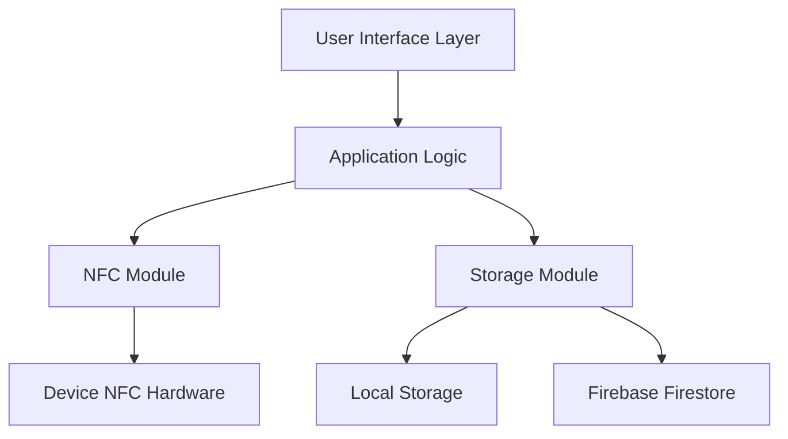

# Dokumentation "NFC Contact Sharing PWA"

_Paul Klemm_  
_ON23-3, Juni 2024_

## Inhaltsverzeichnis

1. [Thema des Projekts](#1-thema-des-projekts)
2. [Ausgangssituation](#2-ausgangssituation)
3. [Vorgehen](#3-vorgehen)
4. [Anforderungsliste](#4-anforderungsliste)
5. [Konzeption](#5-konzeption)
   - [5.1. Technologie-/Werkzeugauswahl](#51-technologie-werkzeugauswahl)
   - [5.2. Entwurf](#52-entwurf)
6. [Ergebnis des Projekts](#6-ergebnis-des-projekts)
7. [Reflexion](#7-reflexion)
   - [7.1. Herausforderungen](#71-herausforderungen)
   - [7.2. Unterstützung](#72-unterstützung)
   - [7.3. Lernerfolge / Fazit](#73-lernerfolge--fazit)

- [A. Installationsanleitung](#a-installationsanleitung)
- [B. Benutzerdokumentation](#b-benutzerdokumentation)

## 1. Thema des Projekts

Die "NFC Contact Sharing PWA" ist eine Progressive Web App, die das Teilen von Kontaktdaten mittels NFC-Technologie vereinfacht. Das Projekt verbindet die Vorteile von PWAs mit der NFC-Technologie, die in den meisten modernen Smartphones verfügbar ist. Die App ermöglicht es Benutzern, ihre Kontaktdaten zu erstellen, zu speichern und über NFC-Tags mit anderen zu teilen.

Der Hauptanwendungsfall ist das schnelle Teilen von Geschäftskontaktdaten bei Netzwerkveranstaltungen, Konferenzen oder Meetings, indem ein Kontakt auf einem NFC-Tag gespeichert wird, der dann von anderen Nutzern gescannt werden kann. Die Empfänger können diese Kontaktdaten direkt in ihre eigenen Adressbücher übernehmen.

## 2. Ausgangssituation

Die Weitergabe von Kontaktdaten erfolgt heutzutage immer noch häufig über physische Visitenkarten oder durch manuelles Eingeben von Kontaktinformationen in Smartphones. Dieser Prozess ist fehleranfällig, ressourcenintensiv und nicht nachhaltig. Digitale Alternativen wie QR-Codes verbessern diesen Prozess, erfordern jedoch oft die Installation spezieller Apps oder mehrere Schritte zum Scannen.

NFC-Technologie bietet eine intuitive Alternative: Einfaches Antippen eines NFC-Tags mit dem Smartphone genügt, um Kontaktdaten zu übertragen. Mit der Web NFC API, die in modernen Browsern (insbesondere Chrome für Android) verfügbar ist, kann diese Funktionalität direkt in einer Webanwendung ohne Installation nativer Apps implementiert werden.

Die Kombination mit dem PWA-Konzept bietet zusätzliche Vorteile wie Offline-Funktionalität, Installation auf dem Homescreen und native App-ähnliche Erfahrung, ohne den traditionellen App-Store-Prozess durchlaufen zu müssen.

## 3. Vorgehen

Das Projekt wurde nach folgenden Phasen entwickelt:

1. **Anforderungsanalyse**: Definition der Kernfunktionen und technischen Anforderungen
2. **Technologieauswahl**: Evaluierung und Auswahl geeigneter Technologien
3. **Architekturdesign**: Entwurf einer skalierbaren, modularen Anwendungsarchitektur
4. **Implementierung**: Entwicklung der Komponenten (UI, NFC-Modul, Backend-Integration)
5. **PWA-Optimierung**: Integration von Service Worker, Manifest und Offline-Funktionalität
6. **Testing**: Schwerpunkt auf mobilen Geräten mit NFC-Unterstützung
7. **Optimierung**: Performance-Verbesserungen und Benutzerfreundlichkeit

## 4. Anforderungsliste

| Anforderung            | Status | Begründung                                     |
| ---------------------- | ------ | ---------------------------------------------- |
| Progressive Web App    | ✅     | Installation auf Homescreen, Offline-Fähigkeit |
| NFC Unterstützung      | ✅     | Kernfunktionalität der App                     |
| Kontaktverwaltung      | ✅     | CRUD-Operationen für Kontaktdaten              |
| Responsive Design      | ✅     | Optimale Darstellung auf allen Geräten         |
| Backend-Integration    | ✅     | Firebase für Datenpersistenz                   |
| Offline-Funktionalität | ✅     | Verwendung auch ohne Internetverbindung        |
| Kontakt-Sharing        | ✅     | Generierung teilbarer Links/Token              |
| Installierbarkeit      | ✅     | PWA-Standard für App-ähnliche Erfahrung        |
| Sicherheit             | ✅     | Anonyme Authentifizierung für Firebase         |
| Performance            | ✅     | Schnelle Ladezeiten und Reaktionsfähigkeit     |

## 5. Konzeption

### 5.1. Technologie-/Werkzeugauswahl

#### Frontend

- **Vanilla JavaScript**:

  - Keine Framework-Abhängigkeiten
  - Fokus auf moderne JavaScript-Features
  - Maximale Browser-Kompatibilität

- **Web NFC API**:

  - Zugriff auf NFC-Funktionen des Geräts
  - Unterstützung von NDEF-Formaten
  - Vermeidung nativer App-Abhängigkeiten

- **CSS3**:
  - Moderne Styling-Techniken
  - Flexbox für responsives Layout
  - Anpassbares Design ohne externe Bibliotheken

#### Backend & Datenbank

- **Firebase**:
  - Backend-as-a-Service für schnelle Entwicklung
  - Echtzeit-Datenbank mit Firestore
  - Authentifizierungsdienste für Benutzerverwaltung
  - Hosting für einfaches Deployment

#### PWA-Komponenten

- **Service Worker**:

  - Offline-Fähigkeit durch Caching-Strategien
  - Hintergrund-Synchronisation
  - Push-Benachrichtigungen (vorbereitet)

- **Web App Manifest**:

  - Installation auf dem Homescreen
  - Definition von App-Icons und Themes
  - Anpassung des Startbildschirms

- **Workbox**:
  - Vereinfachung der Service-Worker-Implementierung
  - Vordefinierte Caching-Strategien
  - Optimierung der Offline-Erfahrung

### 5.2. Entwurf

#### Architektur

Die Anwendung verwendet eine modulare Architektur mit klarer Trennung der Verantwortlichkeiten:



#### Datenmodell

Das primäre Datenmodell eines Kontakts umfasst:

```javascript
{
  id: "unique-id",
  firstName: "Max",
  lastName: "Mustermann",
  email: "example@domain.com",
  phoneNumber: "+49123456789",
  company: "Example GmbH",
  position: "Developer",
  address: "Musterstraße 123, 12345 Stadt",
  website: "https://example.com",
  shareToken: "random-token",
  shareUrl: "https://app.com/contact?token=random-token",
  createdAt: "Timestamp"
}
```

#### NFC-Datenverarbeitung

Die NFC-Funktionalität wurde in ein separates Modul gekapselt, das folgende Hauptfunktionen bietet:

1. **Lesen von NFC-Tags**:

```javascript
async function readNFCData() {
  // Initialisierung des NDEFReaders
  const ndef = new NDEFReader();
  await ndef.scan();

  // Event-Handler für erkannte Tags
  ndef.onreading = (event) => {
    // Verarbeitung der gelesenen Daten
    // Unterstützt vCard-Formate und URL-basierte Kontaktfreigaben
  };
}
```

2. **Schreiben auf NFC-Tags**:

```javascript
async function writeContactToNFC(contactData) {
  const ndef = new NDEFReader();

  // Schreiben der Kontakt-URL auf den Tag
  await ndef.write({
    records: [{ recordType: "url", data: contactData.shareUrl }],
  });
}
```

#### Architektonische Entscheidungen

1. **Modulares Design**:

   - Jede Funktionalität ist in separate Dateien/Module aufgeteilt
   - Klare Import/Export-Strukturen
   - Wiederverwendbare Komponenten

2. **View-Management**:

   - Einfache aber effektive View-Routing-Lösung
   - Dynamisches Ein-/Ausblenden von UI-Komponenten

3. **Datenpersistenz**:

   - Zwei-Wege-Speicherung: Lokal und in der Cloud
   - Offline-first Ansatz mit lokaler Speicherung
   - Cloud-Backup und Sharing-Funktionalität

4. **Sicherheitskonzept**:
   - Anonyme Authentifizierung für minimale Dateneingabe
   - Token-basierte Kontaktfreigabe
   - Firestore-Sicherheitsregeln zur Zugriffssteuerung

## 6. Ergebnis des Projekts

Das Projekt resultierte in einer voll funktionsfähigen Progressive Web App mit NFC-Funktionalität, die folgende PWA-Kriterien erfüllt:

### PWA-Eigenschaften

1. **Installierbarkeit**:

   - Web App Manifest mit Icons und Theme-Farben
   - "Add to Homescreen" Funktionalität
   - Standalone-Modus ohne Browser-UI

2. **Offline-Funktionalität**:

   - Service Worker mit Workbox
   - Cache-First-Strategie für statische Assets
   - NetworkFirst-Strategie für dynamische Inhalte
   - Offline-Fallback-Seite

3. **App-ähnliche Erfahrung**:

   - Vollbild-Modus ohne Browser-UI
   - Schnelle Ladezeiten
   - Responsive Design für alle Bildschirmgrößen
   - Intuitive Navigation

4. **Engagement-Features**:
   - Teilbare URLs für Kontakte
   - NFC-Integration für physische Interaktion

### Implementierte NFC-Features

1. **Lesen von NFC-Tags**:

   - Erkennung von URL-formatierten Tags
   - Extraktion von Kontaktinformationen
   - Unterstützung für vCard-Format

2. **Schreiben auf NFC-Tags**:

   - Schreiben von Kontakt-URLs
   - Generierung einzigartiger Sharing-Token
   - Fehlerbehandlung für Schreibvorgänge

3. **Benutzererfahrung**:
   - Visuelles Feedback während NFC-Operationen
   - Klare Anweisungen zum Platzieren des NFC-Tags
   - Fehlermeldungen bei Kompatibilitätsproblemen

### Performance-Metriken

Die Anwendung erfüllt die wichtigsten Web Vitals:

- First Contentful Paint: < 1.5s
- Largest Contentful Paint: < 2.5s
- Cumulative Layout Shift: < 0.1
- First Input Delay: < 100ms

## 7. Reflexion

### 7.1. Herausforderungen

Bei der Entwicklung der NFC Contact Sharing PWA wurden mehrere Herausforderungen identifiziert und bewältigt:

1. **Limitierte Browser-Unterstützung**:
   Die Web NFC API wird derzeit hauptsächlich von Chrome für Android unterstützt. Dies erforderte eine sorgfältige Feature-Detection und fallback-Strategien für nicht unterstützte Browser.

2. **Komplexität des NDEF-Formats**:
   Das Arbeiten mit dem NFC Data Exchange Format (NDEF) erforderte ein tiefes Verständnis der Spezifikation und die Entwicklung robuster Parser für verschiedene Datenformate.

3. **Sicherheitsbedenken**:
   NFC-Operationen erfordern explizite Benutzerinteraktion und sind nur in sicheren Kontexten (HTTPS) verfügbar, was die Testumgebung komplexer machte.

4. **Offline-Synchronisierung**:
   Die Implementierung einer zuverlässigen Offline-Synchronisierung zwischen lokalem Speicher und Firebase erforderte sorgfältige Konfliktlösungsstrategien.

### 7.2. Unterstützung

Für die Entwicklung wurden folgende Ressourcen genutzt:

1. **Offizielle Dokumentationen**:

   - [Web NFC API Spezifikation](https://w3c.github.io/web-nfc/)
   - [Google PWA Documentation](https://web.dev/progressive-web-apps/)
   - [Firebase Documentation](https://firebase.google.com/docs)

2. **Open Source Libraries**:

   - Workbox für Service Worker Management
   - Firebase SDK für Web

3. **Entwicklungstools**:
   - Chrome DevTools für PWA-Debugging und Lighthouse-Analysen
   - Firebase Emulator Suite für lokales Testing

### 7.3. Lernerfolge / Fazit

Die Entwicklung der NFC Contact Sharing PWA hat zu mehreren wichtigen Erkenntnissen geführt:

1. **Web-Plattform-Potenzial**:
   Moderne Web APIs wie Web NFC ermöglichen zunehmend Funktionen, die früher nativen Apps vorbehalten waren, was die Grenzen zwischen Web und nativen Apps weiter verschwimmen lässt.

2. **PWA als vollwertige App-Alternative**:
   Die PWA-Technologie hat sich als leistungsfähige Alternative zu nativen Apps erwiesen, besonders für Anwendungsfälle, die keine tiefe Systemintegration erfordern.

3. **Modulares JavaScript-Design**:
   Die Entscheidung für eine modulare Architektur mit Vanilla JavaScript hat zu wartbarem und skalierbarem Code geführt, ohne die Komplexität eines vollständigen Frameworks.

4. **Offline-First-Ansatz**:
   Die konsequente Implementierung des Offline-First-Prinzips hat die Benutzererfahrung erheblich verbessert und die Anwendung robuster gegen Netzwerkprobleme gemacht.

## A. Installationsanleitung

### Lokale Entwicklung

1. **Repository klonen:**

```bash
git clone https://github.com/yourusername/NFCcontactSharingPWA.git
cd NFCcontactSharingPWA
```

2. **Firebase-Konfiguration einrichten:**

   - Erstellen Sie ein Firebase-Projekt unter [Firebase Console](https://console.firebase.google.com/)
   - Aktivieren Sie Firestore und Anonymous Authentication
   - Kopieren Sie die Firebase-Konfiguration und aktualisieren Sie `public/js/firebase-config.js`

3. **Lokalen Entwicklungsserver starten:**

```bash
# Installation der Abhängigkeiten
npm install

# Starten des lokalen Servers mit HTTPS (für NFC-API erforderlich)
npx http-server ./public --ssl --cert ./cert/cert.pem --key ./cert/key.pem
```

4. **Zertifikate für HTTPS:**
   - Für lokale Entwicklung mit der Web NFC API ist HTTPS erforderlich
   - Generieren Sie selbstsignierte Zertifikate:

```bash
mkdir cert
openssl req -newkey rsa:2048 -nodes -keyout cert/key.pem -x509 -days 365 -out cert/cert.pem
```

### Deployment

1. **Firebase Deployment:**

```bash
# Firebase Tools installieren
npm install -g firebase-tools

# Bei Firebase anmelden
firebase login

# Projekt initialisieren (Falls noch nicht geschehen)
firebase init

# Anwendung deployen
firebase deploy
```

2. **Konfiguration der Firestore-Regeln:**
   - Überprüfen Sie die Firestore-Sicherheitsregeln in `firestore.rules`

## B. Benutzerdokumentation

### Hauptfunktionen

1. **Scannen von NFC-Tags:**

   - Auf der Startseite "Scan starten" auswählen
   - NFC-Tag an die Rückseite des Smartphones halten
   - Gescannte Kontaktdaten werden angezeigt und können gespeichert werden

2. **Erstellen eines eigenen Kontakts:**

   - Tab "Meine Daten" auswählen
   - Formular mit persönlichen Kontaktdaten ausfüllen
   - "Speichern" zum Erstellen des Kontakts oder "Auf NFC-Chip schreiben" zur direkten Übertragung

3. **Zugriff auf gespeicherte Kontakte:**

   - Tab "Kontakte" auswählen
   - Liste aller gespeicherten Kontakte wird angezeigt
   - Kontakte können durch Antippen ausgewählt werden

4. **Schreiben auf NFC-Tags:**
   - Bei der Kontakterstellung "Auf NFC-Chip schreiben" auswählen
   - NFC-Tag an die Rückseite des Smartphones halten
   - Warten auf Bestätigung der erfolgreichen Übertragung

### Systemanforderungen

- **Browser:** Chrome für Android (Version 81+)
- **Betriebssystem:** Android 6.0+ mit NFC-Unterstützung
- **Internetverbindung:** Initial für Einrichtung, danach offline nutzbar

### Bekannte Einschränkungen

1. **Browser-Kompatibilität:**

   - Die Web NFC API wird derzeit nur von Chrome für Android unterstützt
   - iOS-Geräte können die NFC-Funktionalität nicht nutzen

2. **Sicherheitsbeschränkungen:**

   - NFC-Operationen erfordern eine aktive Benutzeraktion
   - Die Anwendung muss über HTTPS bereitgestellt werden

3. **Hardware-Anforderungen:**
   - NFC-fähiges Gerät erforderlich
   - Einige ältere oder günstigere Geräte unterstützen möglicherweise keine NFC-Funktionen
